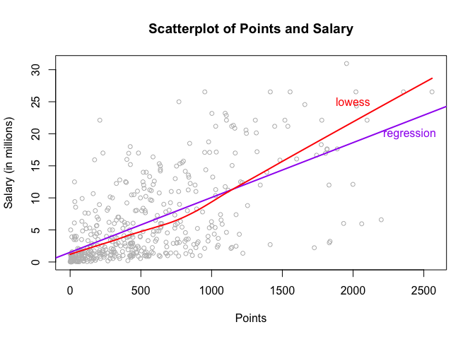

hw01-Zihao-Li
================

``` r
load("data/nba2017-salary-points.RData")
ls()
```

    ## [1] "experience" "player"     "points"     "points1"    "points2"   
    ## [6] "points3"    "position"   "salary"     "team"

#### Data preprocessing:

``` r
salary_million <- salary/1000000
salary_million <- round(salary_million, digits = 2)
salary_million
```

    ##   [1] 26.54 12.00  8.27  1.45  1.41  6.59  6.29  1.83  4.74  5.00  1.22
    ##  [12]  3.09  3.58  1.91  8.00  7.81  0.02  0.26  0.27  0.01  9.70 12.80
    ##  [23]  1.55  0.54 21.17  5.24 17.64 30.96  2.50 15.33  1.59  7.33  1.58
    ##  [34] 26.54 14.20  0.54  2.70 14.38 12.00  1.92  0.87  5.30  1.20  6.05
    ##  [45] 12.25  3.73 22.12  1.20  1.19  0.54 15.94  5.00 16.96 12.00  7.40
    ##  [56]  5.89  0.54  2.87  3.39  1.50  2.71 23.18  8.40  0.39 15.73  4.00
    ##  [67]  2.50  4.84  1.02 20.07  0.42  3.85  2.28  3.00 17.10  5.37  1.55
    ##  [78] 12.52 15.20  0.92  9.61  1.40 10.50  1.81  6.35  2.57  2.37  2.70
    ##  [89] 10.23  4.58  0.65  8.80  1.05  1.80  4.00  4.00 10.77  2.46 18.31
    ## [100]  1.05 14.15  3.49  1.45  2.11  0.87  2.09 23.20  1.02  1.64 17.55
    ## [111]  1.71  3.18  5.78  0.75 14.00 13.22  2.90 15.89 22.12  4.00  5.78
    ## [122]  0.87  2.59  1.23  0.21  0.54  5.63  4.00  6.00  1.02 22.12  6.50
    ## [133]  1.55  7.00  0.87  1.70  6.00 10.99  3.68  4.62  0.65  2.26 14.96
    ## [144]  2.97 17.20  1.05  0.10  0.87  5.32  2.73  6.51  0.16 12.00  6.33
    ## [155] 12.25 13.00 12.50 20.87  6.00  0.54 24.56  0.14 11.24 21.32 17.00
    ## [166]  1.02  4.32  3.90  6.19  0.54  0.54  2.90  0.54  1.41  1.38  4.35
    ## [177] 17.00  5.00  7.25  0.98  2.61 17.00 15.00  6.54  0.03  3.91 11.75
    ## [188]  0.03  0.95 10.00  0.03  2.32  9.00  4.79  9.42  4.83  1.51  2.99
    ## [199]  1.03  1.02  8.00  0.09  0.87  8.55  1.33  6.09  0.12 21.17  1.56
    ## [210]  1.07 11.48  0.98  3.00  3.33  1.79  2.50  1.40  0.98  0.73  9.25
    ## [221] 11.13  1.17  1.55 15.33  1.02  0.98  1.40 26.54  1.18 16.66  0.38
    ## [232]  0.54  5.78 12.11  2.90  0.54 10.00  1.55  0.54  1.18  2.90  0.17
    ## [243]  0.87 17.64  1.19 20.58 14.00  3.58 15.50 14.45  0.68  0.54  1.30
    ## [254] 12.39  0.26 26.54  0.54  7.00  1.00  6.00 18.74  1.72  7.81  0.15
    ## [265]  1.32 11.00 20.14  1.55  1.27 22.87 21.17  0.54  7.38 13.25  2.20
    ## [276]  1.40  3.50  1.55  5.63 10.15  7.00  3.94 11.05  8.00 16.07  1.02
    ## [287]  2.25 11.00  0.60  0.94  1.41  2.12  2.43  2.34  5.99  2.18  2.44
    ## [298]  2.48 17.15  0.98  1.19  4.84  3.75  0.25 26.54  0.54  3.14  8.95
    ## [309]  6.55  0.94  5.70 22.12  1.37  2.90  0.98  1.29 21.17 26.54  5.51
    ## [320]  3.33  4.26  1.79  0.08 10.36  7.68 18.50  3.22 24.33  6.67 16.39
    ## [331]  0.60  1.92  8.99  9.21  2.75  0.87  1.35  0.54 15.05  8.07  3.24
    ## [342]  1.66  3.21  4.54  1.99 12.08  1.63  2.33  3.50  1.36  5.00  3.53
    ## [353] 11.20  4.60 22.12  0.02  0.54  2.98 16.96  0.58  8.08  0.17 11.29
    ## [364]  9.90  0.06 11.24  2.09  0.65  1.02  4.23 25.00  0.54  8.38 22.12
    ## [375]  4.10  0.06  4.38  0.54  0.87  2.90 17.10  0.21  8.00 12.50  4.01
    ## [386]  3.52  5.23  8.00  2.20  8.05  5.20  1.44 13.33  1.19  1.32 10.66
    ## [397]  3.55  2.02  6.01  3.50  7.64  2.35  3.91  5.96  3.87  3.80  0.14
    ## [408] 13.55  3.05  1.34  2.24  5.28  7.60  5.33  0.07  1.03 12.50  3.27
    ## [419]  1.21 18.00  1.55  5.44  6.19  1.05 16.00  1.73  0.87  4.82 12.61
    ## [430]  0.54  2.22  4.28  0.02 14.00 10.47  4.00  2.94  0.28  2.13  0.92
    ## [441] 12.41

``` r
experience_new <- replace(experience, experience == "R", 0)
experience_int <- as.integer(experience_new)
experience_int
```

    ##   [1]  9 11  6  0  9  5  4  2  0  6  1  3  2  1  4 10 12 11  5  1  5 12 13
    ##  [24]  0  8 13  5 13 15  5  2  5  1  7  7  0  0  4 10  2  1  5  0  6  7  2
    ##  [47]  4  7  1  0  8  8  6  9  5  3  0  0  3  0  3 12  8 11  4 12  0 14  3
    ##  [70] 10  3 10  3  3  6  2 17  4  4  0  3  8  4  1  9  0  3  8 12 11  0  7
    ##  [93]  1  6  6  5 11  1  6  1  9  8  1  1  1  0 13  3  1  5  2  3  2  0 10
    ## [116]  8  4  8  4  7  9  1  1  6  0  0  2 13  7  1  4  4 12  1  1  0  6  5
    ## [139]  3  5  0  3  5  1  5  4  1  1  3  1  4  2  5  9 11  4  4  8  9  0 13
    ## [162]  0  8  7  9  3  1  4  5  0  0  0  0  9  0  2  5  9  8  2  2  4  8  7
    ## [185]  0  1  5  0  0  4  0  0  7  1  8  0  1  2  1  3  4  0  1  6  0  4  3
    ## [208]  8  0  0  6  2  2  2  4 10  1  2  2  6 12  0 13  4  3  2  8  9  1  5
    ## [231] 13  0 11  7 13  0  7 11  0  0  3  9  1  5  2 10 14  7 15 15  2  0  2
    ## [254]  8  0  7  0 11  1  4  8  1 12  0  7  4  6 11  0 11  8  0 10 16  8  8
    ## [277] 18 11  6  5 13  1  6  8  6  3  2 15  0  1  2  3  5  1  0  3  0  2  5
    ## [300]  2  1  4 12  5  8  0  3  7  3  0  8  5  0  2  2  1  8  9 12  3 18  0
    ## [323]  0 15  6  3  3  4  6  6  0  2  4  4  2  1  2  0  7  7  1  2  0 12  0
    ## [346]  5  0  3 16  1  8  4  8  6  4  1  0  7  6  4  5  4  7  6  0  3  2  0
    ## [369]  3 12 18  0  2  4 10  0  2  0  1  3  7  0  8  9  3  0  7  6  0  8  2
    ## [392]  0 10  0  7  7  1  2  2  8  6  3  7  1  0  1  7  5  3  1  2  0  9  1
    ## [415]  0  0  2  2  1 12 16  9  2  4  6  2  1  3  5  0  1  0  2  6  9 13  0
    ## [438] 11  2  0 15

``` r
position_fac <- factor(position)
position_fac
```

    ##   [1] C  PF SG PG SF PG SF SG SF PF PF C  SG PG C  C  SF PG PF C  SG SG SF
    ##  [24] PG PF SG PG SF SF C  SF SG PG SG SF PG C  C  PG C  SG SF PF PF PF SF
    ##  [47] SG PG PF C  C  C  PG C  PF SF SG SG PG SF PG C  PF PG SF PF PG SF C 
    ##  [70] PF PF SF SG SF C  PF SG C  SF SG PG PF PF SG PF C  SG PG C  SF PF PG
    ##  [93] PG PF SG PF SG C  SF PF PF SG PF PG C  SG SG SG PG SF C  PG PF SF PG
    ## [116] C  SG PG C  PF PF SG SF SF PF SG PG C  SG C  C  C  PG C  SG PF PG PF
    ## [139] SG SF SG SF PG SF PF PG PG PF PF C  SG PF PG SG PF SF C  SG PG SG SF
    ## [162] PG SG PG C  SG PF C  PF C  PF SF SG SG C  SF C  PG PG SF PG SG PF SG
    ## [185] SG SF C  SG C  SF PF PF SG C  PG C  SF SG C  SF PG C  PG C  SF PF SG
    ## [208] C  SF PG PG SG C  SF PF SG SF SG PG PF SF C  C  PF SG PF C  SF C  SG
    ## [231] SF SG PG PG C  SG SG PF PF PG C  C  SG SF SG PF SG PG C  PG PG C  C 
    ## [254] SG PG PG PF SG C  SG PF SF SF SF SF SG PF PF PF PG C  C  SG SG SF C 
    ## [277] SF PG SF SG PF PG PF PG SF C  SF SF PF PG SG C  PG PF SG SF PF SF C 
    ## [300] SF PF SF PF PG PG PG C  PF SG PG PF SF C  SF PF PF C  PG SG SG SF PG
    ## [323] SG PF SF SG SG PG PF SF SF C  SF PF PF SG PG SG SF PF PG SG SG PG PF
    ## [346] PF SG C  SF C  C  SG SF C  C  SF PF SF C  PF SG SG PG C  PG SF PG C 
    ## [369] SG PG PF PF C  PF PG PF C  SF C  PG SG PG PF SG SG SG PG SG C  C  PG
    ## [392] SG SF PF PG SF C  PF SF SG C  PF C  C  PG PF SF PG SF PG SG SF SF PG
    ## [415] SG C  SG PF PF SF SF SG C  PF C  PG C  C  SG SF SG PF SG PG PF SG PF
    ## [438] PG SF PG C 
    ## Levels: C PF PG SF SG

``` r
levels(position_fac) <- c("center", "power_fwd", "point_guard", "small_fwd", "shoot_guard")
table(position_fac)
```

    ## position_fac
    ##      center   power_fwd point_guard   small_fwd shoot_guard 
    ##          89          89          85          83          95

As shown, the frequency for center is 89, power fwd is 89, point guard is 85, small fwd is 83, and shoot guard is 95.

#### Scatterplot of points and salary:

``` r
plot(points, salary_million, xlab = "Points", ylab = "Salary (in millions)", 
     main = "Scatterplot of Points and Salary", col = "red", pch = 1, cex = 0.8)
```


#### Correlation between points and salary:

``` r
n <- length(points)
x_mean <- sum(points)/n
x_mean
```

    ## [1] 546.6054

``` r
y_mean <- sum(salary_million)/n
y_mean
```

    ## [1] 6.186689

``` r
x_var <- sum((points - x_mean)^2)/(n-1)
x_var
```

    ## [1] 239136.2

``` r
y_var <- sum((salary_million - y_mean)^2)/(n-1)
y_var
```

    ## [1] 43.19524

``` r
x_sd <- sqrt(x_var)
x_sd
```

    ## [1] 489.0156

``` r
y_sd <- sqrt(y_var)
y_sd
```

    ## [1] 6.572309

``` r
covariance <- sum((points - x_mean)*(salary_million - y_mean))/(n-1)
covariance
```

    ## [1] 2046.424

``` r
correlation <- covariance/(x_sd*y_sd)
correlation
```

    ## [1] 0.6367296

#### Linear Regression:

``` r
b1 <- correlation*y_sd/x_sd
b1
```

    ## [1] 0.008557567

``` r
b0 <- y_mean - b1*x_mean
b0
```

    ## [1] 1.509077

``` r
y_hat <- b0 + b1*points
summary(y_hat)
```

    ##    Min. 1st Qu.  Median    Mean 3rd Qu.    Max. 
    ##   1.509   2.844   5.206   6.187   8.184  23.400

The equation of the regression line is: Y = 1.5090766 + 0.0085576X

-   The coefficient b1 can be interpreted as the expected increase in salary (in unit of millions), when the points scored increases by 1.
-   The intercept b0 can be interpreted as the salary of a player who scores zero points.
-   The predicted salaries (in millions, rounded to 3 digits) for players that score:
    -   **0 point:** 1.509 million
    -   **100 points:** 1.5090766 + 0.0085576\*100 = 2.365 million
    -   **500 points:** 1.5090766 + 0.0085576\*500 = 5.788 million
    -   **1000 points:** 1.5090766 + 0.0085576\*1000 = 10.067 million
    -   **2000 points:** 1.5090766 + 0.0085576\*2000 = 18.624 million

#### Plotting the Regression Line

``` r
plot(points, salary_million, xlab = "Points", ylab = "Salary (in millions)", 
     main = "Scatterplot of Points and Salary", col = "grey", pch = 1, cex = 0.8)
abline(b0, b1, lwd = 2, col = "purple")
lines(lowess(points, salary_million, f = 2/3), col = "red", lwd = 2)
text(2400,20,labels = "regression", col = "purple")
text(2000,25,labels = "lowess", col = "red")
```



#### Regression Residuals and Coefficient of Determination

``` r
residual <- salary_million - (b0 + b1*points)
summary(residual)
```

    ##    Min. 1st Qu.  Median    Mean 3rd Qu.    Max. 
    ## -14.190  -2.792  -1.095   0.000   2.556  18.810

``` r
RSS <- sum(residual^2)
RSS
```

    ## [1] 11300.45

``` r
TSS <- sum((salary_million - y_mean)^2)
TSS
```

    ## [1] 19005.91

``` r
R2 <-  1 - RSS/TSS
R2
```

    ## [1] 0.4054246

#### Exploring Position and Experience

``` r
plot(experience_int, salary_million, xlab = "Years of Experience", 
     ylab = "Salary (in millions)", main = "Scatterplot with Lowess Smooth",
     col = "grey", pch = 1, cex = 0.8)
lines(lowess(experience_int, salary_million, f = 2/3), col = "red", lwd = 2)
```


``` r
library("scatterplot3d")
scatterplot3d(points, experience_int, salary_million, 
              main = "3D Plot of Salary with respect to Points and Experience", 
              xlab = "Points", ylab = "Experience", zlab = "Salary (in millions)", color = "red")
```


``` r
boxplot(salary_million ~ position_fac, xlab = "Position", ylab = "Salary (in millions)", 
        main = "Boxplot for Salary and Position", par(mar=c(6,4,4,4)))
```


-   Brief descriptions for the plots:
    -   The first plot shows the relationship between salary and experience. It is evident that salary increases as experience increases in the first 7-8 years, as the player gets more mature and skilled. However, salary decreases afterwards, even though experience continues to increase. This is because as the play gets older, he is not as strong and flexible as he used to be, and thus his salary decreases accordingly. The standard deviation of salaries as experience gets larger also increases significantly.
    -   The second 3D plot shows how salary is a function of both points and experience. In general salary increases as points and experience increase, but points play a bigger role than experience.
    -   The boxplot compares salary of different positions. The mean salary of each position is approximately the same, but standard deviation varies a lot. More specifically, there is not outlier for "Center", but there are outliers for other positions. The third quantile of "Center" is also higher than other positions.
-   Experience does seem to be related to salary. It shows a positive relation when experience is less than 7 or 8 years, but shows a negative relation after that. However, this relation is not as strong as that between salary and points.

-   Salary does seem to be related to position. Even though the mean salary for each position is similar, the standard deviation varies. The third quantile salary for "Center" players is higher, which means that there is a higher proportion of "Center" players who earn more than the mean.

#### Reflections

-   Vector subsetting is still quite hard. I haven't seen some functions such as replace(), so it took some time to learn it.
-   Plotting is relatively easy. The parameters to specify can be figured out after a couple of trials.
-   This is the first time I use git. I find it very convenient, since it's easy to push a local file to github and save it there.
-   I like github. It's very convenient to keep projects and data, and it carries the idea of open source.
-   I didn't really get help from anyone, and so it cost me some time to figure some parts out.
-   It took me around two hours to complete the homework.
-   The most time consuming part is calculating the correlation, since there are a lot of things to calculate in the process.
-   Even though plotting is easy(ish), there are still some parameters that I do not understand. I hope we could go over plotting a little bit in class.
-   The y-axis label of the boxplot didn't show up at first, and it took me a while to fix that problem.
-   I'm somehow proud of making the plot, since it's quite fun to change the parameters and experiment with those.
