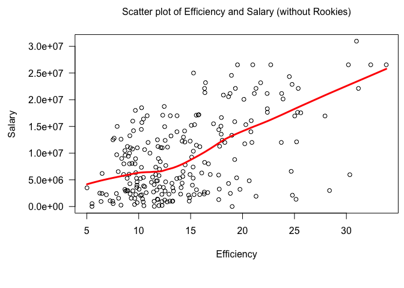

hw02-Zihao-Li
================

#### Importing data file:

``` r
dat1 <- read.csv("data/nba2017-player-statistics.csv", colClasses = 
                   c("character", "character", "factor", "character", "real", rep("integer", 19)))
levels(dat1$Position) <- c("center", "power_fwd", "point_guard", "small_fwd", "shoot_guard")
str(dat1)
```

    ## 'data.frame':    441 obs. of  24 variables:
    ##  $ Player      : chr  "Al Horford" "Amir Johnson" "Avery Bradley" "Demetrius Jackson" ...
    ##  $ Team        : chr  "BOS" "BOS" "BOS" "BOS" ...
    ##  $ Position    : Factor w/ 5 levels "center","power_fwd",..: 1 2 5 3 4 3 4 5 4 2 ...
    ##  $ Experience  : chr  "9" "11" "6" "R" ...
    ##  $ Salary      : num  26540100 12000000 8269663 1450000 1410598 ...
    ##  $ Rank        : int  4 6 5 15 11 1 3 13 8 10 ...
    ##  $ Age         : int  30 29 26 22 31 27 26 21 20 29 ...
    ##  $ GP          : int  68 80 55 5 47 76 72 29 78 78 ...
    ##  $ GS          : int  68 77 55 0 0 76 72 0 20 6 ...
    ##  $ MIN         : int  2193 1608 1835 17 538 2569 2335 220 1341 1232 ...
    ##  $ FGM         : int  379 213 359 3 95 682 333 25 192 114 ...
    ##  $ FGA         : int  801 370 775 4 232 1473 720 58 423 262 ...
    ##  $ Points3     : int  86 27 108 1 39 245 157 12 46 45 ...
    ##  $ Points3_atts: int  242 66 277 1 111 646 394 35 135 130 ...
    ##  $ Points2     : int  293 186 251 2 56 437 176 13 146 69 ...
    ##  $ Points2_atts: int  559 304 498 3 121 827 326 23 288 132 ...
    ##  $ FTM         : int  108 67 68 3 33 590 176 6 85 26 ...
    ##  $ FTA         : int  135 100 93 6 41 649 217 9 124 37 ...
    ##  $ OREB        : int  95 117 65 2 17 43 48 6 45 60 ...
    ##  $ DREB        : int  369 248 269 2 68 162 367 20 175 213 ...
    ##  $ AST         : int  337 140 121 3 33 449 155 4 64 71 ...
    ##  $ STL         : int  52 52 68 0 9 70 72 10 35 26 ...
    ##  $ BLK         : int  87 62 11 0 7 13 23 2 18 17 ...
    ##  $ TO          : int  116 77 88 0 25 210 79 4 68 39 ...

``` r
library(readr)
dat2 <- read_csv("data/nba2017-player-statistics.csv", col_types = cols(
  .default = col_integer(),
  Player = col_character(),
  Team = col_character(),
  Experience = col_character(),
  Position = col_factor(NULL)
)
)
```

    ## Warning in rbind(names(probs), probs_f): number of columns of result is not
    ## a multiple of vector length (arg 1)

    ## Warning: 46 parsing failures.
    ## row # A tibble: 5 x 5 col     row    col               expected  actual expected   <int>  <chr>                  <chr>   <chr> actual 1     2 Salary no trailing characters .20E+07 file 2    10 Salary no trailing characters .00E+06 row 3    15 Salary no trailing characters .00E+06 col 4    39 Salary no trailing characters .20E+07 expected 5    52 Salary no trailing characters .00E+06 actual # ... with 1 more variables: file <chr>
    ## ... ................. ... ............................................. ........ ............................................. ...... ............................................. .... ............................................. ... ............................................. ... ............................................. ........ ............................................. ...... .......................................
    ## See problems(...) for more details.

``` r
levels(dat2$Position) <- c("center", "power_fwd", "point_guard", "small_fwd", "shoot_guard")
str(dat2)
```

    ## Classes 'tbl_df', 'tbl' and 'data.frame':    441 obs. of  24 variables:
    ##  $ Player      : chr  "Al Horford" "Amir Johnson" "Avery Bradley" "Demetrius Jackson" ...
    ##  $ Team        : chr  "BOS" "BOS" "BOS" "BOS" ...
    ##  $ Position    : Factor w/ 5 levels "center","power_fwd",..: 1 2 3 4 5 4 5 3 5 2 ...
    ##  $ Experience  : chr  "9" "11" "6" "R" ...
    ##  $ Salary      : int  26540100 NA 8269663 1450000 1410598 6587132 6286408 1825200 4743000 NA ...
    ##  $ Rank        : int  4 6 5 15 11 1 3 13 8 10 ...
    ##  $ Age         : int  30 29 26 22 31 27 26 21 20 29 ...
    ##  $ GP          : int  68 80 55 5 47 76 72 29 78 78 ...
    ##  $ GS          : int  68 77 55 0 0 76 72 0 20 6 ...
    ##  $ MIN         : int  2193 1608 1835 17 538 2569 2335 220 1341 1232 ...
    ##  $ FGM         : int  379 213 359 3 95 682 333 25 192 114 ...
    ##  $ FGA         : int  801 370 775 4 232 1473 720 58 423 262 ...
    ##  $ Points3     : int  86 27 108 1 39 245 157 12 46 45 ...
    ##  $ Points3_atts: int  242 66 277 1 111 646 394 35 135 130 ...
    ##  $ Points2     : int  293 186 251 2 56 437 176 13 146 69 ...
    ##  $ Points2_atts: int  559 304 498 3 121 827 326 23 288 132 ...
    ##  $ FTM         : int  108 67 68 3 33 590 176 6 85 26 ...
    ##  $ FTA         : int  135 100 93 6 41 649 217 9 124 37 ...
    ##  $ OREB        : int  95 117 65 2 17 43 48 6 45 60 ...
    ##  $ DREB        : int  369 248 269 2 68 162 367 20 175 213 ...
    ##  $ AST         : int  337 140 121 3 33 449 155 4 64 71 ...
    ##  $ STL         : int  52 52 68 0 9 70 72 10 35 26 ...
    ##  $ BLK         : int  87 62 11 0 7 13 23 2 18 17 ...
    ##  $ TO          : int  116 77 88 0 25 210 79 4 68 39 ...
    ##  - attr(*, "problems")=Classes 'tbl_df', 'tbl' and 'data.frame': 46 obs. of  5 variables:
    ##   ..$ row     : int  2 10 15 39 52 54 66 95 96 115 ...
    ##   ..$ col     : chr  "Salary" "Salary" "Salary" "Salary" ...
    ##   ..$ expected: chr  "no trailing characters" "no trailing characters" "no trailing characters" "no trailing characters" ...
    ##   ..$ actual  : chr  ".20E+07" ".00E+06" ".00E+06" ".20E+07" ...
    ##   ..$ file    : chr  "'data/nba2017-player-statistics.csv'" "'data/nba2017-player-statistics.csv'" "'data/nba2017-player-statistics.csv'" "'data/nba2017-player-statistics.csv'" ...
    ##  - attr(*, "spec")=List of 2
    ##   ..$ cols   :List of 24
    ##   .. ..$ Player      : list()
    ##   .. .. ..- attr(*, "class")= chr  "collector_character" "collector"
    ##   .. ..$ Team        : list()
    ##   .. .. ..- attr(*, "class")= chr  "collector_character" "collector"
    ##   .. ..$ Position    :List of 3
    ##   .. .. ..$ levels    : NULL
    ##   .. .. ..$ ordered   : logi FALSE
    ##   .. .. ..$ include_na: logi FALSE
    ##   .. .. ..- attr(*, "class")= chr  "collector_factor" "collector"
    ##   .. ..$ Experience  : list()
    ##   .. .. ..- attr(*, "class")= chr  "collector_character" "collector"
    ##   .. ..$ Salary      : list()
    ##   .. .. ..- attr(*, "class")= chr  "collector_integer" "collector"
    ##   .. ..$ Rank        : list()
    ##   .. .. ..- attr(*, "class")= chr  "collector_integer" "collector"
    ##   .. ..$ Age         : list()
    ##   .. .. ..- attr(*, "class")= chr  "collector_integer" "collector"
    ##   .. ..$ GP          : list()
    ##   .. .. ..- attr(*, "class")= chr  "collector_integer" "collector"
    ##   .. ..$ GS          : list()
    ##   .. .. ..- attr(*, "class")= chr  "collector_integer" "collector"
    ##   .. ..$ MIN         : list()
    ##   .. .. ..- attr(*, "class")= chr  "collector_integer" "collector"
    ##   .. ..$ FGM         : list()
    ##   .. .. ..- attr(*, "class")= chr  "collector_integer" "collector"
    ##   .. ..$ FGA         : list()
    ##   .. .. ..- attr(*, "class")= chr  "collector_integer" "collector"
    ##   .. ..$ Points3     : list()
    ##   .. .. ..- attr(*, "class")= chr  "collector_integer" "collector"
    ##   .. ..$ Points3_atts: list()
    ##   .. .. ..- attr(*, "class")= chr  "collector_integer" "collector"
    ##   .. ..$ Points2     : list()
    ##   .. .. ..- attr(*, "class")= chr  "collector_integer" "collector"
    ##   .. ..$ Points2_atts: list()
    ##   .. .. ..- attr(*, "class")= chr  "collector_integer" "collector"
    ##   .. ..$ FTM         : list()
    ##   .. .. ..- attr(*, "class")= chr  "collector_integer" "collector"
    ##   .. ..$ FTA         : list()
    ##   .. .. ..- attr(*, "class")= chr  "collector_integer" "collector"
    ##   .. ..$ OREB        : list()
    ##   .. .. ..- attr(*, "class")= chr  "collector_integer" "collector"
    ##   .. ..$ DREB        : list()
    ##   .. .. ..- attr(*, "class")= chr  "collector_integer" "collector"
    ##   .. ..$ AST         : list()
    ##   .. .. ..- attr(*, "class")= chr  "collector_integer" "collector"
    ##   .. ..$ STL         : list()
    ##   .. .. ..- attr(*, "class")= chr  "collector_integer" "collector"
    ##   .. ..$ BLK         : list()
    ##   .. .. ..- attr(*, "class")= chr  "collector_integer" "collector"
    ##   .. ..$ TO          : list()
    ##   .. .. ..- attr(*, "class")= chr  "collector_integer" "collector"
    ##   ..$ default: list()
    ##   .. ..- attr(*, "class")= chr  "collector_integer" "collector"
    ##   ..- attr(*, "class")= chr "col_spec"

#### Processing of "Experience"

``` r
dat1$Experience[dat1$Experience == "R"] <- "0"
dat1$Experience <- as.integer(dat1$Experience)
typeof(dat1$Experience)
```

    ## [1] "integer"

#### Performance of players

Adding variables to the data frame:

``` r
dat1$Missed_FG <- dat1$FGA - dat1$FGM
dat1$Missed_FT <- dat1$FTA - dat1$FTM
dat1$PTS <- dat1$Points3*3 + dat1$Points2*2 + dat1$FTM
dat1$REB <- dat1$OREB + dat1$DREB
dat1$MPG <- dat1$MIN/dat1$GP

dat1$EFF <- (dat1$PTS + dat1$REB + dat1$AST + dat1$STL + dat1$BLK - dat1$Missed_FG - dat1$Missed_FT - dat1$TO) / dat1$GP
summary(dat1$EFF)
```

    ##    Min. 1st Qu.  Median    Mean 3rd Qu.    Max. 
    ##  -0.600   5.452   9.090  10.140  13.250  33.840

``` r
hist(dat1$EFF, main = "Histogram of Efficiency (EFF)", xlab = "EFF", ylab = "Frequency", las = 1, col = "grey")
```


``` r
EFF_order <- dat1[order(dat1$EFF, decreasing = T),]
EFF_order[1:5, c("Player", "Team", "Salary", "EFF")]
```

    ##                 Player Team   Salary      EFF
    ## 305  Russell Westbrook  OKC 26540100 33.83951
    ## 256       James Harden  HOU 26540100 32.34568
    ## 355      Anthony Davis  NOP 22116750 31.16000
    ## 28        LeBron James  CLE 30963450 30.97297
    ## 404 Karl-Anthony Towns  MIN  5960160 30.32927

``` r
dat1$Player[dat1$EFF<0]
```

    ## [1] "Patricio Garino"

``` r
cor_PTS <- cor(dat1$PTS, dat1$EFF)
cor_PTS
```

    ## [1] 0.8588644

``` r
cor_REB <- cor(dat1$REB, dat1$EFF)
cor_REB
```

    ## [1] 0.7634501

``` r
cor_AST <- cor(dat1$AST, dat1$EFF)
cor_AST
```

    ## [1] 0.6689232

``` r
cor_STL <- cor(dat1$STL, dat1$EFF)
cor_STL
```

    ## [1] 0.6957286

``` r
cor_BLK <- cor(dat1$BLK, dat1$EFF)
cor_BLK
```

    ## [1] 0.5679571

``` r
cor_Missed_FG <- -cor(dat1$Missed_FG, dat1$EFF)
cor_Missed_FG
```

    ## [1] -0.7722477

``` r
cor_Missed_FT <- -cor(dat1$Missed_FT, dat1$EFF)
cor_Missed_FT
```

    ## [1] -0.7271456

``` r
cor_TO <- -cor(dat1$TO, dat1$EFF)
cor_TO
```

    ## [1] -0.8003289

``` r
overall_cor <- c(cor_PTS, cor_REB, cor_AST, cor_STL, cor_BLK, cor_Missed_FG, cor_Missed_FT, cor_TO)
overall_cor <- sort(overall_cor, decreasing = T)
overall_cor
```

    ## [1]  0.8588644  0.7634501  0.6957286  0.6689232  0.5679571 -0.7271456
    ## [7] -0.7722477 -0.8003289

``` r
color <- c("red", "grey")[(overall_cor > 0)+1]

barplot(overall_cor, main = "Correlations between Player Stats and EFF", ylim = c(-1.0, 1.0), names.arg = c("PTS", "REB", "AST", "STL", "BLK", "Missed_FG", "Missed_FT", "TO"), col = color, border = NA, cex.names = 0.65)
```


#### Efficiency and Salary

``` r
par(mar = c(6.5, 6.5, 3, 0.5))
plot(dat1$EFF, dat1$Salary, xlab = "", ylab = "", las = 1, cex = 0.9)
mtext(side=1, text="Efficiency", line=3)
mtext(side=2, text="Salary", line=5)
mtext(side=3, text="Scatter plot of Efficiency and Salary", line=1.5)
lines(lowess(dat1$EFF, dat1$Salary), lwd = 3, col = "red")
```


``` r
linear_cor <- cor(dat1$EFF, dat1$Salary)
linear_cor
```

    ## [1] 0.655624

The relationship between EFF and salary is positively correlated, with a correlation coefficient equal to 0.66. It means that the more efficient a player is, the higher the salary he will get.

For rookie players:

``` r
dat1$Player[dat1$MPG >=20]
```

    ##   [1] "Al Horford"               "Amir Johnson"            
    ##   [3] "Avery Bradley"            "Isaiah Thomas"           
    ##   [5] "Jae Crowder"              "Kelly Olynyk"            
    ##   [7] "Marcus Smart"             "Deron Williams"          
    ##   [9] "Edy Tavares"              "Iman Shumpert"           
    ##  [11] "J.R. Smith"               "Kevin Love"              
    ##  [13] "Kyle Korver"              "Kyrie Irving"            
    ##  [15] "LeBron James"             "Richard Jefferson"       
    ##  [17] "Tristan Thompson"         "Cory Joseph"             
    ##  [19] "DeMar DeRozan"            "DeMarre Carroll"         
    ##  [21] "Jonas Valanciunas"        "Kyle Lowry"              
    ##  [23] "P.J. Tucker"              "Patrick Patterson"       
    ##  [25] "Serge Ibaka"              "Bojan Bogdanovic"        
    ##  [27] "Bradley Beal"             "John Wall"               
    ##  [29] "Marcin Gortat"            "Markieff Morris"         
    ##  [31] "Otto Porter"              "Dennis Schroder"         
    ##  [33] "Dwight Howard"            "Ersan Ilyasova"          
    ##  [35] "Kent Bazemore"            "Paul Millsap"            
    ##  [37] "Thabo Sefolosha"          "Tim Hardaway"            
    ##  [39] "Giannis Antetokounmpo"    "Greg Monroe"             
    ##  [41] "Jabari Parker"            "Khris Middleton"         
    ##  [43] "Malcolm Brogdon"          "Matthew Dellavedova"     
    ##  [45] "Tony Snell"               "C.J. Miles"              
    ##  [47] "Jeff Teague"              "Lance Stephenson"        
    ##  [49] "Monta Ellis"              "Myles Turner"            
    ##  [51] "Paul George"              "Thaddeus Young"          
    ##  [53] "Dwyane Wade"              "Jimmy Butler"            
    ##  [55] "Nikola Mirotic"           "Rajon Rondo"             
    ##  [57] "Robin Lopez"              "Dion Waiters"            
    ##  [59] "Goran Dragic"             "Hassan Whiteside"        
    ##  [61] "James Johnson"            "Josh Richardson"         
    ##  [63] "Justise Winslow"          "Rodney McGruder"         
    ##  [65] "Tyler Johnson"            "Wayne Ellington"         
    ##  [67] "Andre Drummond"           "Ish Smith"               
    ##  [69] "Jon Leuer"                "Kentavious Caldwell-Pope"
    ##  [71] "Marcus Morris"            "Reggie Jackson"          
    ##  [73] "Tobias Harris"            "Cody Zeller"             
    ##  [75] "Frank Kaminsky"           "Kemba Walker"            
    ##  [77] "Marco Belinelli"          "Marvin Williams"         
    ##  [79] "Michael Kidd-Gilchrist"   "Nicolas Batum"           
    ##  [81] "Carmelo Anthony"          "Courtney Lee"            
    ##  [83] "Derrick Rose"             "Joakim Noah"             
    ##  [85] "Kristaps Porzingis"       "Lance Thomas"            
    ##  [87] "Aaron Gordon"             "Bismack Biyombo"         
    ##  [89] "Elfrid Payton"            "Evan Fournier"           
    ##  [91] "Jeff Green"               "Jodie Meeks"             
    ##  [93] "Nikola Vucevic"           "Terrence Ross"           
    ##  [95] "Alex Poythress"           "Dario Saric"             
    ##  [97] "Gerald Henderson"         "Jahlil Okafor"           
    ##  [99] "Jerryd Bayless"           "Joel Embiid"             
    ## [101] "Justin Anderson"          "Nik Stauskas"            
    ## [103] "Richaun Holmes"           "Robert Covington"        
    ## [105] "Sergio Rodriguez"         "T.J. McConnell"          
    ## [107] "Brook Lopez"              "Caris LeVert"            
    ## [109] "Isaiah Whitehead"         "Jeremy Lin"              
    ## [111] "Joe Harris"               "Rondae Hollis-Jefferson" 
    ## [113] "Sean Kilpatrick"          "Spencer Dinwiddie"       
    ## [115] "Trevor Booker"            "Andre Iguodala"          
    ## [117] "Draymond Green"           "Kevin Durant"            
    ## [119] "Klay Thompson"            "Matt Barnes"             
    ## [121] "Stephen Curry"            "Danny Green"             
    ## [123] "Kawhi Leonard"            "LaMarcus Aldridge"       
    ## [125] "Patty Mills"              "Pau Gasol"               
    ## [127] "Tony Parker"              "Clint Capela"            
    ## [129] "Eric Gordon"              "James Harden"            
    ## [131] "Lou Williams"             "Patrick Beverley"        
    ## [133] "Ryan Anderson"            "Trevor Ariza"            
    ## [135] "Troy Williams"            "Austin Rivers"           
    ## [137] "Blake Griffin"            "Chris Paul"              
    ## [139] "DeAndre Jordan"           "J.J. Redick"             
    ## [141] "Jamal Crawford"           "Luc Mbah a Moute"        
    ## [143] "Raymond Felton"           "Derrick Favors"          
    ## [145] "George Hill"              "Gordon Hayward"          
    ## [147] "Joe Ingles"               "Joe Johnson"             
    ## [149] "Rodney Hood"              "Rudy Gobert"             
    ## [151] "Shelvin Mack"             "Andre Roberson"          
    ## [153] "Domantas Sabonis"         "Enes Kanter"             
    ## [155] "Russell Westbrook"        "Steven Adams"            
    ## [157] "Taj Gibson"               "Victor Oladipo"          
    ## [159] "Andrew Harrison"          "James Ennis"             
    ## [161] "JaMychal Green"           "Marc Gasol"              
    ## [163] "Mike Conley"              "Tony Allen"              
    ## [165] "Vince Carter"             "Zach Randolph"           
    ## [167] "Al-Farouq Aminu"          "Allen Crabbe"            
    ## [169] "C.J. McCollum"            "Damian Lillard"          
    ## [171] "Evan Turner"              "Jusuf Nurkic"            
    ## [173] "Maurice Harkless"         "Danilo Gallinari"        
    ## [175] "Emmanuel Mudiay"          "Gary Harris"             
    ## [177] "Jamal Murray"             "Jameer Nelson"           
    ## [179] "Kenneth Faried"           "Mason Plumlee"           
    ## [181] "Nikola Jokic"             "Will Barton"             
    ## [183] "Wilson Chandler"          "Anthony Davis"           
    ## [185] "Axel Toupane"             "Dante Cunningham"        
    ## [187] "DeMarcus Cousins"         "E'Twaun Moore"           
    ## [189] "Jordan Crawford"          "Jrue Holiday"            
    ## [191] "Solomon Hill"             "Tim Frazier"             
    ## [193] "DeAndre Liggins"          "Dirk Nowitzki"           
    ## [195] "Dorian Finney-Smith"      "Harrison Barnes"         
    ## [197] "J.J. Barea"               "Nerlens Noel"            
    ## [199] "Seth Curry"               "Wesley Matthews"         
    ## [201] "Yogi Ferrell"             "Anthony Tolliver"        
    ## [203] "Arron Afflalo"            "Buddy Hield"             
    ## [205] "Darren Collison"          "Garrett Temple"          
    ## [207] "Rudy Gay"                 "Ty Lawson"               
    ## [209] "Tyreke Evans"             "Andrew Wiggins"          
    ## [211] "Brandon Rush"             "Gorgui Dieng"            
    ## [213] "Karl-Anthony Towns"       "Ricky Rubio"             
    ## [215] "Zach LaVine"              "Brandon Ingram"          
    ## [217] "D'Angelo Russell"         "Jordan Clarkson"         
    ## [219] "Julius Randle"            "Larry Nance Jr."         
    ## [221] "Luol Deng"                "Nick Young"              
    ## [223] "Timofey Mozgov"           "Alex Len"                
    ## [225] "Brandon Knight"           "Devin Booker"            
    ## [227] "Eric Bledsoe"             "Jared Dudley"            
    ## [229] "Marquese Chriss"          "T.J. Warren"             
    ## [231] "Tyson Chandler"

``` r
Player2 <- dat1[dat1$MPG >=20, ]
par(mar = c(6.5, 6.5, 3, 0.5))
plot(Player2$EFF, Player2$Salary, xlab = "", ylab = "", las = 1, cex = 0.9)
mtext(side=1, text="Efficiency", line=3)
mtext(side=2, text="Salary", line=5)
mtext(side=3, text="Scatter plot of Efficiency and Salary (without Rookies)", line=1.5)
lines(lowess(Player2$EFF, Player2$Salary), lwd = 3, col = "red")
```



``` r
linear_cor2 <- cor(Player2$EFF, Player2$Salary)
linear_cor2
```

    ## [1] 0.5367224

It is still true that EFF and salary are positively correlated, by the correlation coefficient is smaller for more experience players.
