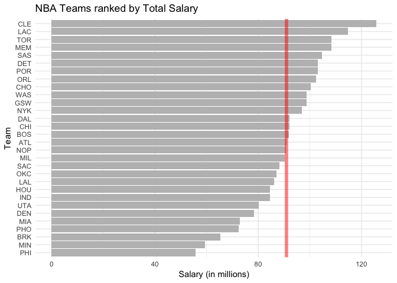
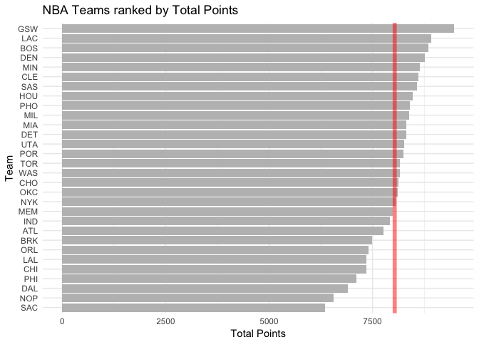
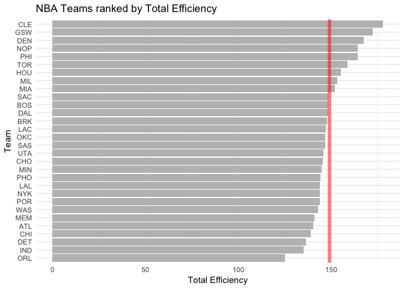
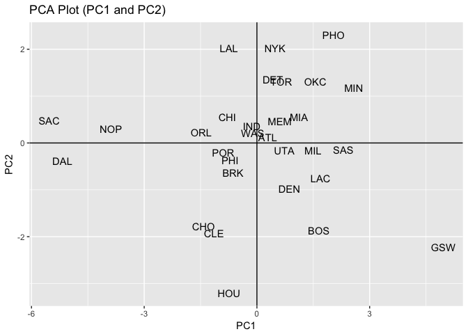
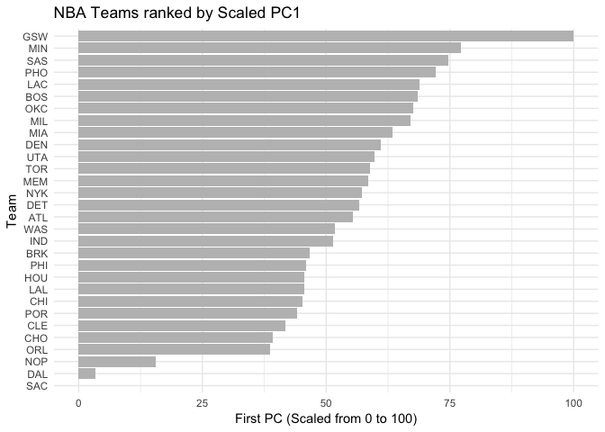

hw03-Zihao-Li
================

Basic rankings:

``` r
library(readr)
library(ggplot2)
teams <- read.csv(file = "data/nba2017-teams.csv")
```

``` r
ggplot1 <- ggplot(teams, aes(x = reorder(team, salary), y = salary)) +
  geom_bar(stat = 'identity', fill = "grey") + coord_flip() +
  geom_hline(yintercept = mean(teams$salary),color = "red", size = 2, alpha = 0.5) + 
  theme_bw() + theme_minimal()
ggplot1 + labs(x = "Team", y = "Salary (in millions)", title = "NBA Teams ranked by Total Salary")
```



``` r
ggplot2 <- ggplot(teams, aes(x = reorder(team, points), y = points)) +
  geom_bar(stat = 'identity', fill = "grey") + coord_flip() +
  geom_hline(yintercept = mean(teams$points), color = "red", size = 2, alpha = 0.5)+ 
  theme_bw() + theme_minimal()
ggplot2 + labs(x = "Team", y = "Total Points", title = "NBA Teams ranked by Total Points")
```



``` r
ggplot3 <- ggplot(teams, aes(x = reorder(team, efficiency), y = efficiency)) +
  geom_bar(stat = 'identity', fill = "grey") + coord_flip() +
  geom_hline(yintercept = mean(teams$efficiency), color = "red", size = 2, alpha = 0.5) +
  theme_bw() + theme_minimal()
ggplot3 + labs(x = "Team", y = "Total Efficiency", title = "NBA Teams ranked by Total Efficiency")
```



Descriptions: The three kinds of rankings seem to differ by a lot. The scales and units are also vastly different. However the shapes of the histograms are sort of similar.

Principle Component Analysis:

``` r
library(dplyr)
```

    ## 
    ## Attaching package: 'dplyr'

    ## The following objects are masked from 'package:stats':
    ## 
    ##     filter, lag

    ## The following objects are masked from 'package:base':
    ## 
    ##     intersect, setdiff, setequal, union

``` r
teams_select <- teams %>% 
  select(points3, points2, free_throws, off_rebounds, def_rebounds, assists, steals, blocks, turnovers, fouls)
pca <- prcomp(teams_select, scale. = T)
eigs <- data.frame(
  eigenvalue = round(pca$sdev^2, digit = 4),
  porp = round(pca$sdev^2 / sum(pca$sdev^2), 4),
  cumprop = round(cumsum(pca$sdev^2 / sum(pca$sdev^2)), 4)
)
eigs
```

    ##    eigenvalue   porp cumprop
    ## 1      4.6959 0.4696  0.4696
    ## 2      1.7020 0.1702  0.6398
    ## 3      0.9795 0.0980  0.7377
    ## 4      0.7717 0.0772  0.8149
    ## 5      0.5341 0.0534  0.8683
    ## 6      0.4780 0.0478  0.9161
    ## 7      0.3822 0.0382  0.9543
    ## 8      0.2603 0.0260  0.9804
    ## 9      0.1336 0.0134  0.9937
    ## 10     0.0627 0.0063  1.0000

``` r
a <- teams$team
pca2 <- data.frame(pca$x)
ggplot(data = pca2) + geom_point(aes(x = pca2[, 1], y = pca2[, 2]), alpha = 0) +
  geom_hline(yintercept=0) + geom_vline(xintercept = 0) +
  labs(x = "PC1", y = "PC2", title = "PCA Plot (PC1 and PC2)") +
  geom_text(x = pca2[, 1], y = pca2[, 2], label = a)
```



When we look at the rotation matrix of the PC's, we clearly see that each PC contributes differently to the overal index. However, we do see that the first PC has similar weights for all variables, which means that it captures the most variability in general.

``` r
s1 <- 100*(pca2[, 1] - min(pca2[, 1]))/(max(pca2[, 1]) - min(pca2[, 1]))
ggplot4 <- ggplot(teams, aes(x = reorder(team, s1), y = s1)) + geom_bar(stat = 'identity', fill = "grey") +
  coord_flip() + theme_bw() + theme_minimal()
ggplot4 + labs(x = "Team", y = "First PC (Scaled from 0 to 100)", title = "NBA Teams ranked by Scaled PC1")
```



Description:

The general shape of the ranking is similar to the previous ones, scaled from 0 to 100. There are some surprising parts. For instance, Cleveland Cavaliers is ranked pretty low using PC1, but they got into the finals last season. Maybe there are some variabilities that aren't captured by the first PC but by other PCs.

Reflections:

-   This is the first time, and I feel sort of confused by this.
-   This is the first time. Since the whole folder might get moved around, using relative paths saves trouble than using absolute path.
-   This is my first time. I feel a bit strange just writing pure code in the script. It feels better to write in a dynamic document.
-   Loading data is still quite hard. It took me a long time to do that. Figuring out the PCA is also hard.
-   Manipulating data frames now feels easy.
-   I spent about three hours completing the homework.
-   I ran into some problems about geom\_text, but I ended up figuring that out by myself.
-   The most time consuming part is loading data.
-   Using the PCA is interesting, though I still don't quite understand the theory behind it.
